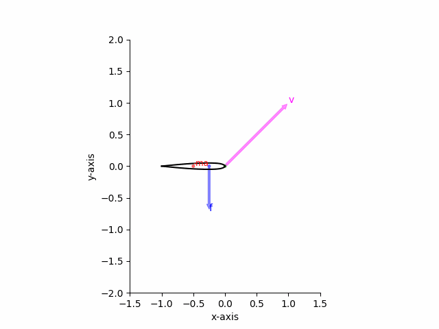
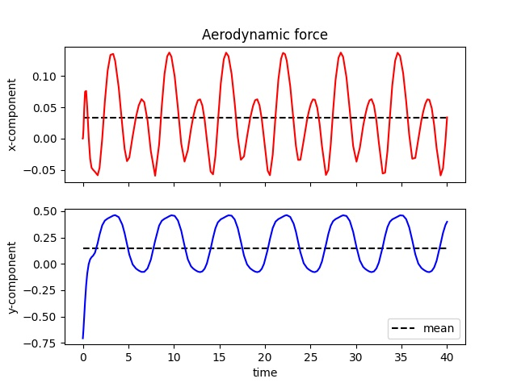

# Ornithopter airfoil simulator

This program calculates the motion of an airfoil attached to an ornithopter wing. The airfoil undergoes a sinusoidal oscillation and its angle is found through a torque balance. With this angle, the lift and thrust of the airfoil are calculated along with their mean values. It is assumed the airfoil is subject to the inertial reaction of its mass, an aerodynamic force, and a damped angular spring. Each of these forces/torques can be adjusted along with the amplitude and frequency of the oscillation. Therefore, it is possible to try out different constraints and observe how they affect lift and thrust.  

### Requirements
The scripts were written in [Python 3.9.5](https://www.python.org/downloads/) and require the following libraries: 
- [numpy](https://numpy.org/install/)
- [scipy](https://scipy.org/install/)
- [matplotlib](https://matplotlib.org/stable/users/installing/index.html) 

### How to use
To execute the program, open the terminal/command prompt and browse to the folder containing main.py and run the command:  
```
>> python3 main.py
```
If you are using windows, you can simply double click interface.py and to open it with [IDLE](https://docs.python.org/3/library/idle.html). 

To adjust the calculations, open input_parameters.py with a text editor and change the variables.

### Sample output




